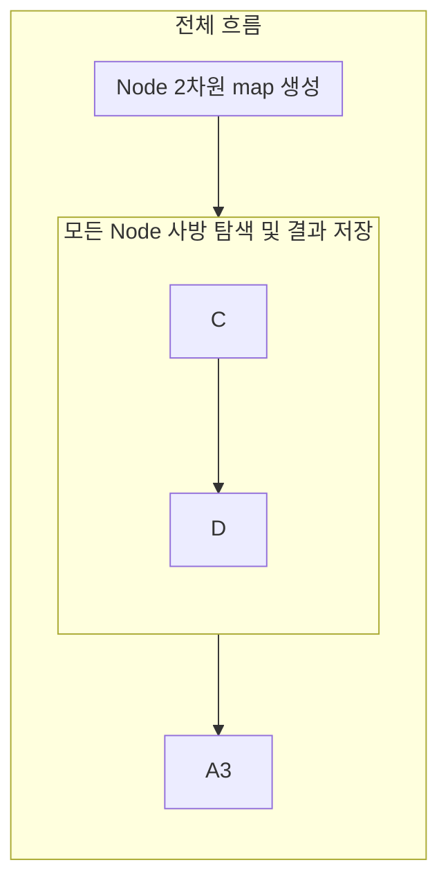

```mermaid
graph LR
   subgraph 전체 흐름
      subgraph A2[모든 Node 사방 탐색 및 결과 저장]
         direction TB
         C --> D

      end
      subgraph A1[Node 2차원 map 생성]
         direction TB

      end
   
   A1 --> A2
   A2 --> A3
   end
```
